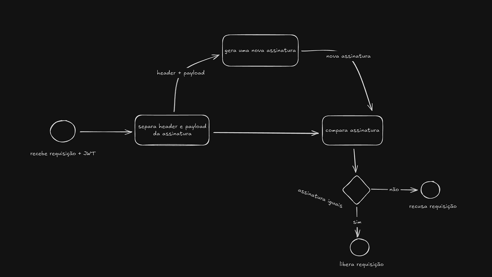

### 🧭 O que é o JWT?

**JWT (JSON Web Token)** é um **padrão aberto** que define um formato compacto para **transmitir informações entre partes** como um **token digital assinado**.
Ele é amplamente usado em sistemas de autenticação para permitir que um usuário **seja autenticado sem precisar manter sessão no servidor**.

Em outras palavras:

> O usuário faz login, recebe um token, e esse token é usado em cada requisição para provar sua identidade.

---

## 🧩 Como funciona

O fluxo básico de autenticação com JWT é o seguinte:

1. O **usuário faz login** enviando suas credenciais.
2. O servidor **valida as credenciais**.
3. Se estiverem corretas, o servidor **gera um JWT** e o devolve ao cliente.
4. A cada requisição, o cliente **envia o token no cabeçalho Authorization**:

   ```
   Authorization: Bearer <seu_token_aqui>
   ```
6. O servidor **valida o token** e, se estiver tudo certo, **autoriza o acesso** ao recurso solicitado.

---

| Parte         | Nome       | Descrição                                                              |
| ------------- | ---------- | ---------------------------------------------------------------------- |
| **Header**    | Cabeçalho  | Informa o tipo de token (JWT) e o algoritmo de assinatura (ex: HS256). |
| **Payload**   | Corpo      | Contém as informações (claims) sobre o usuário e o token.              |
| **Signature** | Assinatura | Garante que o token não foi alterado.                                  |

---

## 🔄 Fluxo JWT



1. Usuário envia credenciais para `/login`.
2. O servidor valida e retorna o token JWT.
3. O cliente envia o token em cada requisição.
4. O servidor valida o token e retorna os dados solicitados.