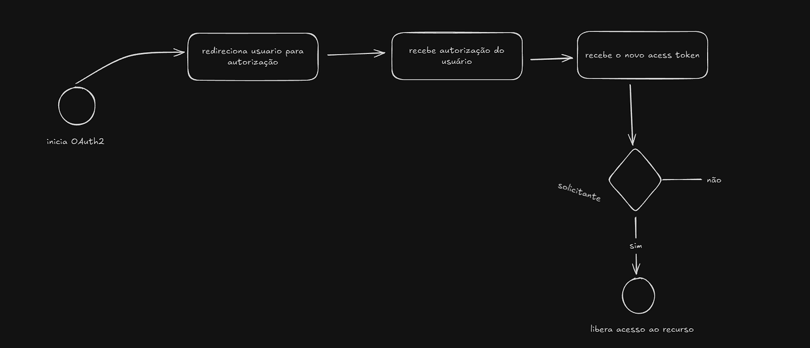

### 🧭 O que é o OAuth2?

**OAuth2** (*Open Authorization 2.0*) é um **protocolo de autorização** que permite que um aplicativo acesse recursos protegidos (como dados de usuário) **em nome do usuário**, **sem precisar das credenciais dele** (usuário e senha).

Em vez de compartilhar a senha, o usuário **autoriza o acesso** concedendo um **token** temporário que representa essa permissão.
Esse token é emitido por um **provedor de autenticação** (como Google, GitHub, Facebook, etc.) e usado pelo aplicativo para fazer requisições seguras.

---

### ⚙️ Exemplo prático

Quando você faz login num site com o botão **"Entrar com o Google"**, o que acontece é o seguinte:

1. O site redireciona você para o **Google**.
2. O Google pede sua permissão para compartilhar seus dados (nome, e-mail, foto, etc.).
3. Após aceitar, o Google retorna ao site com um **token de acesso**.
4. O site usa esse token para buscar suas informações na API do Google — **sem nunca saber sua senha**.

